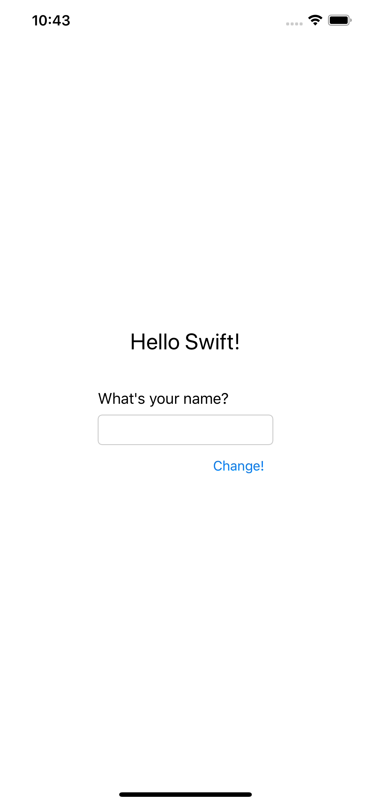
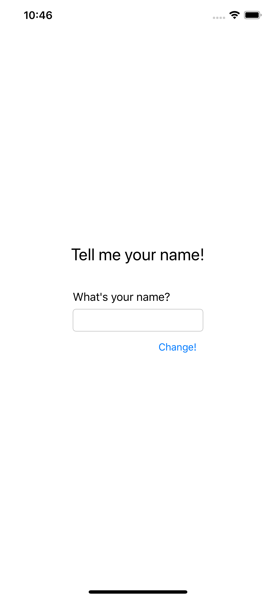
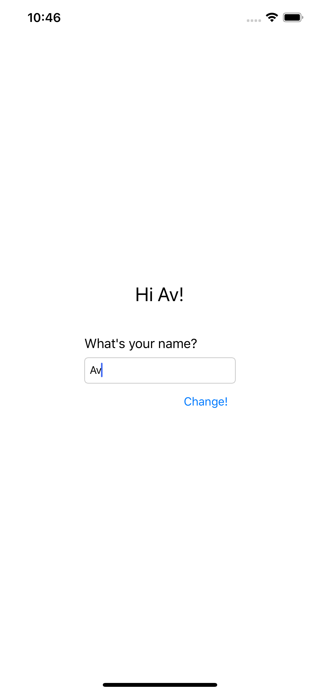

# HelloSwift

## Description
This application is a simple application that can greet users with their name.

## Deskripsi
Aplikasi ini merupakan aplikasi sederhana yang dapat menyapa pengguna dengan nama mereka.

## Programming Language/Bahasa Pemrograman
Swift

